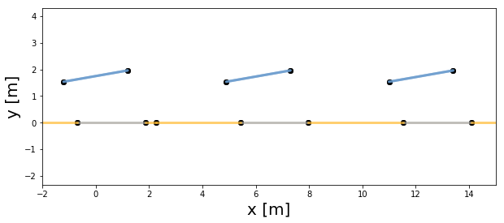

pvfactors (open-source fork of vf_model)
========================================

[](https://circleci.com/gh/SunPower/pvfactors)

pvfactors is a tool designed for PV professionals to calculate the
irradiance incident on surfaces of a photovoltaic array. It relies on the use of
2D geometries and view factors integrated mathematically into a linear system of
equations.

This package is the open-source fork of the original 'vf_model' package developed
by SunPower, and which had over 300 commits. The package was used for all the
material presented at IEEE PVSC 44 2017 (see [1]).


Documentation
-------------

The documentation can be found [here](https://sunpower.github.io/pvfactors).


Installation
------------

pvfactors is currently compatible and tested with Python versions 2.7 and 3.6

You can install the package using [pip](https://pip.pypa.io/en/stable/) and the
wheel file from the latest release in the [release section](https://github.com/SunPower/pvfactors/releases) of this Github repository.

You can also fork this repository and install the pvfactors using [pip](https://pip.pypa.io/en/stable/) in the root folder of the package:

    $ pip install .


To install the package in editable mode, you can use:

    $ pip install -e .


Requirements
------------

Requirements are included in the ``setup.py`` file of the package. Here is
a list of important dependencies:
* [shapely](https://pypi.python.org/pypi/Shapely)
* [numpy](https://pypi.python.org/pypi/numpy)
* [scipy](https://pypi.python.org/pypi/scipy)
* [pandas](https://pypi.python.org/pypi/pandas)
* [pvlib-python](https://pypi.python.org/pypi/pvlib)


Quickstart Example
------------------

The following Jupyter notebook is a good way to get started: [notebook](http://sunpower.github.io/pvfactors/developer/pvfactors_demo.html)


TL;DR
-----

Given some timeseries inputs:


```python
timestamps = np.array([datetime(2017, 8, 31, 11), datetime(2017, 8, 31, 12)])
solar_zenith = np.array([20., 10.])
solar_azimuth = np.array([110., 140.])
array_tilt = np.array([10., 0.])
array_azimuth = np.array([90., 90.])
dni = np.array([1000., 300.])
dhi = np.array([50., 500.])
```

And some PV array parameters:


```python
pvarray_parameters = {
    'n_pvrows': 3,  # number of pv rows
    'pvrow_height': 1.75,  # height of pvrows (measured at center / torque tube)
    'pvrow_width': 2.44,  # width of pvrows
    'gcr': 0.4,  # ground coverage ratio
    'rho_ground': 0.2,  # albedo
}
```

The user can quickly run a timeseries simulation using ``pvfactors`` as shown below:


```python
from pvfactors.timeseries import calculate_radiosities_serially_perez

df_registries, _ = calculate_radiosities_serially_perez((
    pvarray_parameters, timestamps,
    solar_zenith, solar_azimuth,
    array_tilt, array_azimuth, dni, dhi))
```

    Progress: |██████████████████████████████████████████████████| 100.0% Complete


If the raw outputs are too detailed for the user, they can be formatted quickly thanks to helper functions:

```python
from pvfactors.timeseries import get_average_pvrow_outputs

df_avg_outputs = get_average_pvrow_outputs(df_registries,
                                           values=['qinc', 'isotropic_term', 'reflection_term', 'horizon_term'])
df_avg_outputs
```


<div>
<table border="1" class="dataframe">
  <thead>
    <tr>
      <th>pvrow_index</th>
      <th colspan="10" halign="left">0</th>
      <th>...</th>
      <th colspan="10" halign="left">2</th>
    </tr>
    <tr>
      <th>surface_side</th>
      <th colspan="5" halign="left">back</th>
      <th colspan="5" halign="left">front</th>
      <th>...</th>
      <th colspan="5" halign="left">back</th>
      <th colspan="5" halign="left">front</th>
    </tr>
    <tr>
      <th>term</th>
      <th>horizon_term</th>
      <th>isotropic_term</th>
      <th>qinc</th>
      <th>reflection_term</th>
      <th>shaded</th>
      <th>horizon_term</th>
      <th>isotropic_term</th>
      <th>qinc</th>
      <th>reflection_term</th>
      <th>shaded</th>
      <th>...</th>
      <th>horizon_term</th>
      <th>isotropic_term</th>
      <th>qinc</th>
      <th>reflection_term</th>
      <th>shaded</th>
      <th>horizon_term</th>
      <th>isotropic_term</th>
      <th>qinc</th>
      <th>reflection_term</th>
      <th>shaded</th>
    </tr>
    <tr>
      <th>timestamps</th>
      <th></th>
      <th></th>
      <th></th>
      <th></th>
      <th></th>
      <th></th>
      <th></th>
      <th></th>
      <th></th>
      <th></th>
      <th></th>
      <th></th>
      <th></th>
      <th></th>
      <th></th>
      <th></th>
      <th></th>
      <th></th>
      <th></th>
      <th></th>
      <th></th>
    </tr>
  </thead>
  <tbody>
    <tr>
      <th>2017-08-31 11:00:00</th>
      <td>1.221181</td>
      <td>0.117972</td>
      <td>93.339589</td>
      <td>92.000435</td>
      <td>False</td>
      <td>1.640681</td>
      <td>20.982303</td>
      <td>1035.231572</td>
      <td>1.217963e+00</td>
      <td>False</td>
      <td>...</td>
      <td>1.640681</td>
      <td>0.199001</td>
      <td>97.261729</td>
      <td>95.422048</td>
      <td>False</td>
      <td>1.640681</td>
      <td>20.849825</td>
      <td>1034.889434</td>
      <td>1.008302e+00</td>
      <td>False</td>
    </tr>
    <tr>
      <th>2017-08-31 12:00:00</th>
      <td>0.000000</td>
      <td>0.863797</td>
      <td>83.197488</td>
      <td>82.333691</td>
      <td>False</td>
      <td>0.000000</td>
      <td>206.332401</td>
      <td>795.442326</td>
      <td>-5.684342e-14</td>
      <td>False</td>
      <td>...</td>
      <td>0.000000</td>
      <td>382.033336</td>
      <td>170.382030</td>
      <td>-211.651306</td>
      <td>False</td>
      <td>0.000000</td>
      <td>206.332401</td>
      <td>795.442326</td>
      <td>-5.684342e-14</td>
      <td>False</td>
    </tr>
  </tbody>
</table>
<p>2 rows × 30 columns</p>
</div>


The user can also plot the pv array at a given time of the simulation:


```python
from pvfactors.plot import plot_array_from_registry

f, ax = plt.subplots(figsize=(10, 4))
plot_array_from_registry(ax, df_registries.set_index('timestamps').loc["2017-8-31 11:00:00", :])
ax.set_xlim(-2, 15)
plt.show()
```





References
----------

[1] Marc Abou Anoma, David Jacob, Ben C. Bourne, Jonathan A. Scholl,
Daniel M. Riley, Clifford W. Hansen. “View Factor Model and Validation
for Bifacial PV and Diffuse Shade on Single-Axis Trackers.”
Photovoltaic Specialist Conference (PVSC), 2017 IEEE 44th. IEEE, 2017.
