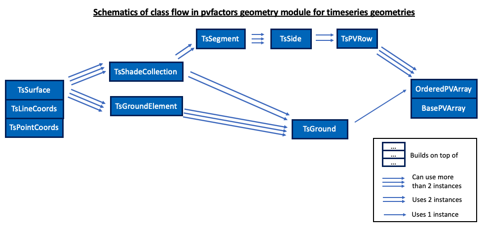

.. _geometry_api:

geometry
--------

The geometry sub-package of pvfactors implements multiple classes that make the construction of a 2D geometry for a PV array intuitive and scalable. It is meant to be decoupled from irradiance and view factor calculations so that it can be used independently for other purposes, like visualization for instance. The following schematics summarizes the organization of the classes in this sub-package.

base
^^^^

.. automodule:: pvfactors.geometry.base
   :no-members:
   :no-inherited-members:
   :noindex:

.. autosummary::
   :toctree: generated/
   :nosignatures:
   :template: class_no_base.rst

   ~pvfactors.geometry.base.BaseSurface
   ~pvfactors.geometry.base.PVSurface
   ~pvfactors.geometry.base.ShadeCollection
   ~pvfactors.geometry.base.PVSegment
   ~pvfactors.geometry.base.BaseSide
   ~pvfactors.geometry.base.BasePVArray

pvrow
^^^^^

.. automodule:: pvfactors.geometry.pvrow
   :no-members:
   :no-inherited-members:
   :noindex:

.. autosummary::
   :toctree: generated/
   :nosignatures:
   :template: class_no_base.rst

   ~pvfactors.geometry.pvrow.TsPVRow
   ~pvfactors.geometry.pvrow.TsSide
   ~pvfactors.geometry.pvrow.TsSegment
   ~pvfactors.geometry.pvrow.PVRowSide
   ~pvfactors.geometry.pvrow.PVRow

pvground
^^^^^^^^

.. automodule:: pvfactors.geometry.pvground
   :no-members:
   :no-inherited-members:
   :noindex:

.. autosummary::
   :toctree: generated/
   :nosignatures:
   :template: class_no_base.rst

   ~pvfactors.geometry.pvground.TsGround
   ~pvfactors.geometry.pvground.TsGroundElement
   ~pvfactors.geometry.pvground.PVGround

pvarray
^^^^^^^

.. automodule:: pvfactors.geometry.pvarray
   :no-members:
   :no-inherited-members:
   :noindex:

.. autosummary::
   :toctree: generated/
   :nosignatures:
   :template: class_no_base.rst

   ~pvfactors.geometry.pvarray.OrderedPVArray

timeseries
^^^^^^^^^^

.. automodule:: pvfactors.geometry.timeseries
   :no-members:
   :no-inherited-members:
   :noindex:

.. autosummary::
   :toctree: generated/
   :nosignatures:
   :template: class_no_base.rst

   ~pvfactors.geometry.timeseries.TsShadeCollection
   ~pvfactors.geometry.timeseries.TsSurface
   ~pvfactors.geometry.timeseries.TsLineCoords
   ~pvfactors.geometry.timeseries.TsPointCoords
